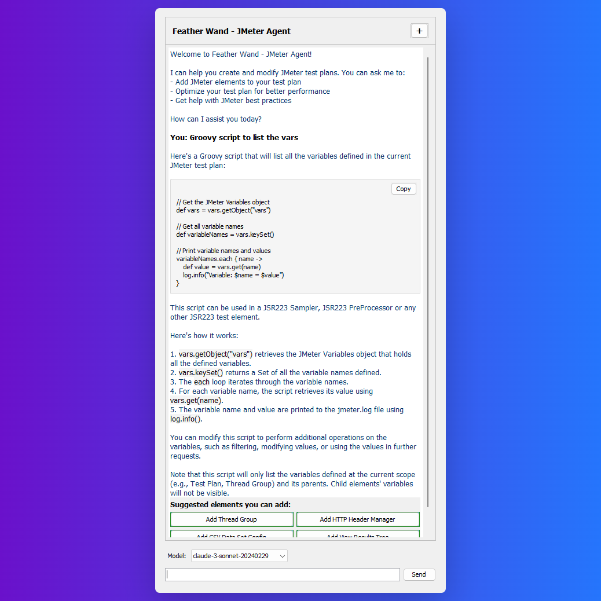
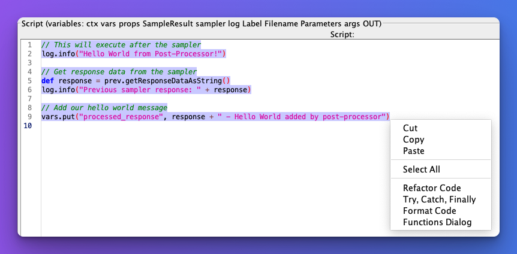

# 🚀 Feather Wand - JMeter Agent

This plugin provides a simple way to chat with AI in JMeter. Feather Wand serves as your intelligent assistant for JMeter test plan development, optimization, and troubleshooting.

> 🪄 **About the name**: The name "Feather Wand" was suggested by my children who were inspired by an episode of the animated show Bluey. In the episode, a simple feather becomes a magical wand that transforms the ordinary into something special (heavy) - much like how this plugin aims to transform your JMeter experience with a touch of AI magic!




## ✨ Features

- Chat with AI directly within JMeter using either Claude or OpenAI models
- Get suggestions for JMeter elements based on your needs
- Ask questions about JMeter functionality and best practices
- Command intellisense with auto-completion for special commands in the chat input box
- Use `@this` command to get detailed information about the currently selected element
- Use `@code` command to extract code blocks from AI responses into the JSR223 editor
- Use `@usage` command to get usage examples for JMeter components
- Use `@lint` command to automatically rename elements in your test plan for better organization and readability
- Use `@optimize` command to get optimization recommendations for the currently selected element in your test plan
- Use `@wrap` command to intelligently group HTTP samplers under Transaction Controllers for better organization and reporting
- Use right click context menu to refactor code, format code, and add functions in JSR223 script editor
- Customize AI behavior through configuration properties
- Switch between Claude and OpenAI models based on your preference or specific needs

## 📥 Installation

### Plugins Manager (Recommended)

1. Install the JMeter Plugins Manager from [Plugins Manager](https://jmeter-plugins.org/).
2. Restart JMeter.
3. Launch Plugins Manager.
4. Search for `feather wand` under `Available Plugins` tab.
5. Select it and click `Apply Changes and Restart JMeter` button.

### Manual Installation (Alternative)

1. Download the latest release JAR file from the [Releases](https://github.com/QAInsights/jmeter-ai/releases) page.
2. Place the JAR file in the `lib/ext` directory of your JMeter installation.
3. Copy the contents of `jmeter-ai-sample.properties` into your `jmeter.properties` file (located in the `bin` directory of your JMeter installation) or into your `user.properties` file.
4. Configure your API key(s) for Anthropic and/or OpenAI in the properties file.
5. Restart JMeter.
6. The Feather Wand plugin will appear as a new component in the right-click menu under "Add" > "Non-Test Elements" > "Feather Wand".

## ⚙️ Configuration

The Feather Wand plugin can be configured through JMeter properties. Copy the `jmeter-ai-sample.properties` file content to your `jmeter.properties` or `user.properties` file and modify the properties as needed.

### 🔧 Available Configuration Options

#### Anthropic (Claude) Configuration

| Property                  | Description                                                  | Default Value              |
| ------------------------- | ------------------------------------------------------------ | -------------------------- |
| `anthropic.api.key`       | Your Claude API key                                          | Required                   |
| `claude.default.model`    | Default Claude model to use                                  | claude-3-sonnet-20240229   |
| `claude.temperature`      | Temperature setting (0.0-1.0)                                | 0.7                        |
| `claude.max.tokens`       | Maximum tokens for AI responses                              | 1024                       |
| `claude.max.history.size` | Maximum conversation history size                            | 10                         |
| `claude.system.prompt`    | System prompt that guides Claude's responses                 | See sample properties file |
| `anthropic.log.level`     | Logging level for Anthropic API requests ("info" or "debug") | Empty (disabled)           |

#### OpenAI Configuration

| Property                  | Description                                               | Default Value              |
| ------------------------- | --------------------------------------------------------- | -------------------------- |
| `openai.api.key`          | Your OpenAI API key                                       | Required                   |
| `openai.default.model`    | Default OpenAI model to use                               | gpt-4o                     |
| `openai.temperature`      | Temperature setting (0.0-1.0)                             | 0.5                        |
| `openai.max.tokens`       | Maximum tokens for AI responses                           | 1024                       |
| `openai.max.history.size` | Maximum conversation history size                         | 10                         |
| `openai.system.prompt`    | System prompt that guides OpenAI's responses              | See sample properties file |
| `openai.log.level`        | Logging level for OpenAI API requests ("INFO" or "DEBUG") | Empty (disabled)           |

#### Code Refactoring Configuration

| Property                  | Description                                                  | Default Value              |
| ------------------------- | ------------------------------------------------------------ | -------------------------- |
| `jmeter.ai.refactoring.enabled` | Enable code refactoring for JSR223 script editor            | true                       |
| `jmeter.ai.service.type` | The AI service to use for code refactoring ("openai" or "anthropic") | "openai"                   |

### 💬 Customizing the System Prompt

The system prompt defines how the AI (Claude or OpenAI) responds to your queries. You can customize this in the properties file to focus on specific aspects of JMeter or add your own guidelines.

Both `claude.system.prompt` and `openai.system.prompt` can be configured separately in the properties file. The default prompts are designed to provide helpful, JMeter-specific responses tailored to each AI model's capabilities.

## 🔍 Special Commands

### 📊 @usage Command

Use the `@usage` command to view detailed token usage information for your AI interactions:

1. **How to Use**:

   - Simply type `@usage` in the chat
   - The command will show usage statistics for either OpenAI or Anthropic depending on which service you're using

2. **Information Provided**:

   - Overall summary of total conversations and tokens used
   - Detailed breakdown of recent conversations (last 10)
   - Token usage per conversation (input and output tokens)
   - Timestamps and model information
   - Link to official pricing pages for cost information

3. **Example Output**:

   ```
   # Usage Summary

   ## Overall Summary
   - Total Conversations: 5
   - Total Input Tokens: 1500
   - Total Output Tokens: 2000
   - Total Tokens: 3500

   ## Recent Conversations
   - Conversation 1: 300 input, 400 output tokens
   - Conversation 2: 250 input, 350 output tokens
   ...
   ```

4. **Benefits**:
   - Track your API usage and costs
   - Monitor token consumption patterns
   - Identify potential optimization opportunities
   - Keep track of conversation history

### 🪄 @this Command

Use the `@this` command in your message to get detailed information about the currently selected element in your test plan. For example:

- "Tell me about @this element"
- "How can I optimize @this?"
- "What are the best practices for @this?"

Feather Wand will analyze the selected element and provide tailored information and advice.

### 🔧 @optimize Command

Use the `@optimize` command (or simply type "optimize") to get optimization recommendations for the currently selected element in your test plan. This command will:

1. Analyze the selected element's configuration
2. Identify potential performance bottlenecks
3. Suggest specific, actionable improvements
4. Provide best practices for that element type

For example, if you have an HTTP Request sampler selected, the optimization recommendations might include:

- Connection and timeout settings adjustments
- Proper header management
- Efficient parameter handling
- Encoding settings optimization
- Redirect handling improvements

Simply select an element in your test plan and type `@optimize` or `optimize` in the chat to receive tailored optimization recommendations.

### 🧹 @lint Command

Use the `@lint` command to automatically rename elements in your test plan for better organization and readability:

1. **How to Use**:

   - Type `@lint` in the chat to analyze your test plan structure
   - The AI will suggest better names for elements based on their function and context
   - Review the suggestions and confirm to apply the changes
   - Use the undo/redo buttons to revert or reapply changes if needed
   - e.g. `@lint rename the elements based on the URL` or `@lint rename the elements in pascal case`

2. **Benefits**:

   - Improves test plan readability and maintenance
   - Applies consistent naming conventions across your test plan
   - Helps identify elements with generic or unclear names
   - Makes test plans more understandable for team members
   - Undo it if you don't like the changes
   - Redo it if you like the changes

3. **Best Practices**:
   - Run `@lint` after creating a new test plan to establish good naming from the start
   - Use it before sharing test plans with team members
   - Apply it to imported test plans to make them conform to your naming standards

This feature is particularly valuable for large test plans or when working in teams where consistent naming is essential for collaboration.

### 📦 @wrap Command

Use the `@wrap` command to intelligently group HTTP samplers under Transaction Controllers for better organization and reporting:

1. **How to Use**:

   - Select a Thread Group in your test plan
   - Type `@wrap` in the chat
   - The AI will analyze your HTTP samplers and group similar ones under Transaction Controllers
   - Use the undo button to revert changes if needed

2. **Benefits**:

   - Improves test plan organization and readability
   - Enhances test reports with meaningful transaction metrics
   - Groups related HTTP requests logically
   - Preserves the original order and hierarchy of samplers
   - Maintains all child elements (like assertions and post-processors) with their parent samplers

3. **How It Works**:
   - Analyzes sampler names and paths to identify logical groupings
   - Creates appropriately named Transaction Controllers
   - Moves samplers under their respective Transaction Controllers
   - Preserves the original order and hierarchy
   - Uses pattern matching and structural analysis (not AI) for its grouping logic

This feature is especially useful for imported or recorded test plans that contain many individual HTTP samplers without proper organization.

## 🗝️ API Configuration

Feather Wand supports both Anthropic (Claude) and OpenAI APIs. You can configure either or both in your properties file.

### Anthropic API (Claude)

1. Go to [Anthropic API](https://www.anthropic.com/) website
2. Sign up for an account
3. Create a new API key
4. Copy the API key and paste it into the `anthropic.api.key` property in your `jmeter.properties` file
5. For more information about the API key, visit the [API Key documentation](https://www.anthropic.com/api)

### OpenAI API

1. Go to [OpenAI API](https://platform.openai.com/) website
2. Sign up for an account
3. Create a new API key
4. Copy the API key and paste it into the `openai.api.key` property in your `jmeter.properties` file
5. For more information about the API key, visit the [API Key documentation](https://platform.openai.com/docs/api-reference)

### Model Selection

Feather Wand automatically filters available models to show only chat-compatible models. By default, it excludes audio, TTS, transcription, and other non-chat models. You can select your preferred model from the dropdown in the UI, or set default models in the properties file:

- For Claude: `claude.default.model` (e.g., `claude-3-7-sonnet-20250219`)
- For OpenAI: `openai.default.model` (e.g., `gpt-4o`)

### Model Filtering

Feather Wand applies intelligent filtering to the available models to ensure you only see relevant chat models in the dropdown:

- **OpenAI Models**: Filters out audio, TTS, whisper, davinci, search, transcribe, realtime, and instruct models to show only GPT chat models.
- **Claude Models**: Shows only the latest available Claude models.

This filtering ensures that you only see models that are compatible with the chat interface and appropriate for JMeter-related tasks.

## 🪲 Report Issues

If you encounter any issues or have suggestions for improvement, please open an issue on the [GitHub repository](https://github.com/qainsights/jmeter-ai).

## ⛳️ Roadmap

Please check the [roadmap](https://github.com/users/QAInsights/projects/12) for more details.

## ⚠️ Disclaimer and Best Practices

While the Feather Wand plugin aims to provide helpful assistance, please keep the following in mind:

- **AI Limitations**: The AI can make mistakes or provide incorrect information. Always verify critical suggestions before implementing them in production tests.
- **Backup Your Test Plans**: Always backup your test plans before making significant changes, especially when implementing AI suggestions.
- **Test Verification**: After making changes based on AI recommendations, thoroughly verify your test plan functionality in a controlled environment before running it against production systems.
- **Performance Impact**: Some AI-suggested configurations may impact test performance. Monitor resource usage when implementing new configurations.
- **Security Considerations**: Do not share sensitive information (credentials, proprietary code, etc.) in your conversations with the AI.
- **API Costs**: Be aware that using the Claude API or OpenAI API incurs costs based on token usage. The plugin is designed to minimize token usage, but excessive use may result in higher costs.

This plugin is provided as a tool to assist JMeter users, but the ultimate responsibility for test plan design, implementation, and execution remains with the user.